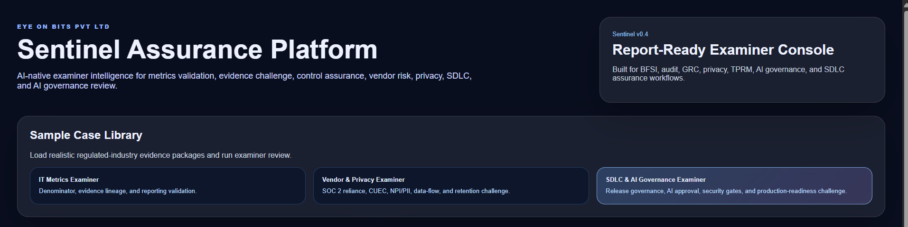
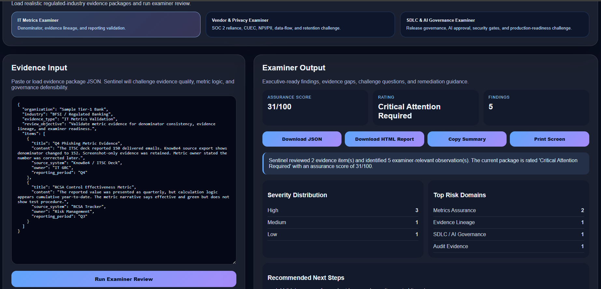
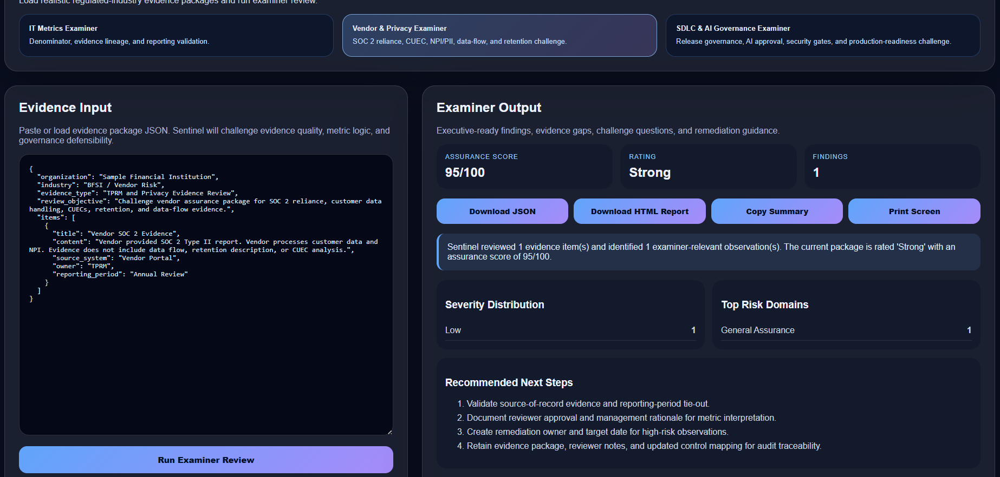
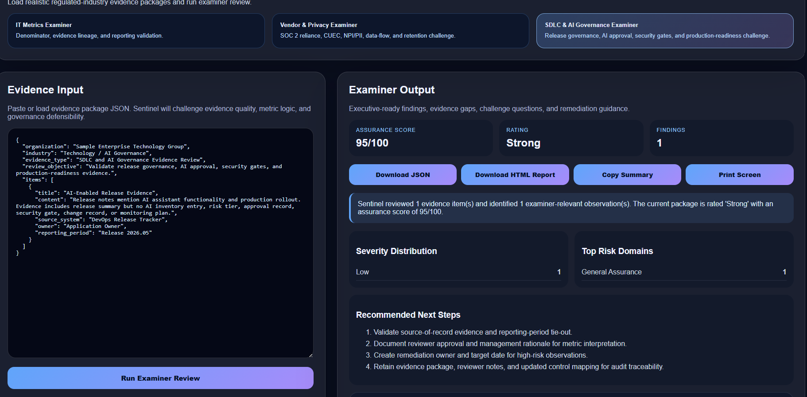
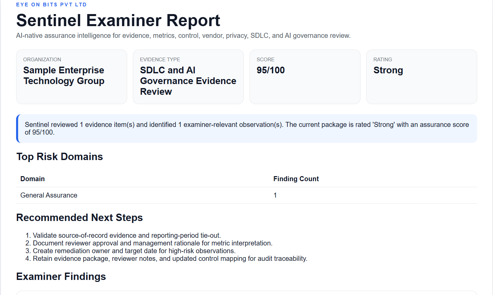

# Sentinel Assurance Platform

**AI-native assurance intelligence platform by Eye On Bits Pvt Ltd.**

Sentinel is an examiner-style assurance intelligence console for regulated organizations. It is designed to challenge evidence, metrics, vendor packages, privacy representations, SDLC artifacts, and AI governance claims.

> Most GRC tools store evidence. Sentinel challenges whether the evidence is defensible.

---

## Current Release

**v0.6 — Launch-Ready Demo Package**

---

## What Sentinel does

Sentinel reviews structured evidence packages and produces:

- Assurance score
- Overall rating
- Severity distribution
- Top risk domains
- Examiner-style findings
- Evidence gaps
- Challenge questions
- Remediation guidance
- Framework relevance tags
- Downloadable JSON report
- Downloadable HTML examiner report

---

## Why this matters

In regulated environments, a control is not defensible merely because evidence exists.

Evidence must prove:

- source lineage
- reporting-period consistency
- denominator/numerator integrity
- reviewer approval
- management rationale
- vendor reliance logic
- privacy/data handling defensibility
- SDLC governance completion
- AI governance readiness

Sentinel is built around that practical assurance problem.

---

## Product screenshots

Add screenshots under `github-assets/` and update these image references after capture:

| Screen | Screenshot file |
|---|---|
| Home / Case Library | `github-assets/01-home-case-library.png` |
| IT Metrics Examiner Output | `github-assets/02-it-metrics-output.png` |
| Vendor & Privacy Examiner Output | `github-assets/03-vendor-privacy-output.png` |
| SDLC & AI Governance Output | `github-assets/04-sdlc-ai-output.png` |
| HTML Examiner Report | `github-assets/05-html-report.png` |

---

## Current modules

### 1. IT Metrics Examiner

Challenges:
- denominator inconsistency
- cumulative vs periodic reporting mismatch
- screenshot-only evidence
- weak source-of-record linkage
- unsupported positive assurance statements

### 2. Vendor & Privacy Examiner

Challenges:
- incomplete SOC 2 reliance
- missing CUEC analysis
- missing data-flow evidence
- weak retention/data handling evidence
- customer data / NPI / PII defensibility gaps

### 3. SDLC & AI Governance Examiner

Challenges:
- missing security gates
- missing change approval evidence
- release governance gaps
- AI inventory/approval gaps
- missing monitoring and escalation evidence

---

## Target users

- IT GRC teams
- CISOs / security governance leaders
- Internal Audit teams
- 2LOD / credible challenge teams
- TPRM teams
- Privacy teams
- AI governance teams
- SDLC / DevSecOps governance teams

---

## Run locally

```powershell
docker compose up --build
```

Open:

```text
Frontend: http://localhost:3000
Backend health: http://localhost:8000/api/health
```

---

## API endpoints

```text
GET  /api/health
POST /api/analyze
POST /api/report-html
```

---

## Example commercial service

**Sentinel Evidence & Metrics Assurance Review**

A consulting-assisted review service where Sentinel accelerates:

- evidence analysis
- examiner-style questions
- finding generation
- remediation evidence requests
- executive reporting

See:

```text
sales/sentinel-assurance-review-service.md
```

---

## Roadmap

| Version | Focus |
|---|---|
| v0.4 | Report-ready examiner console |
| v0.5 | Market and demo package |
| v0.6 | GitHub/LinkedIn launch polish |
| v0.7 | PDF export and finding register |
| v0.8 | Framework mapping library |
| v0.9 | Uploaded evidence parser |
| v1.0 | Multi-domain assurance review workflow |

---

## Disclaimer

Sentinel supports assurance review and professional judgment. It does not replace qualified audit, legal, regulatory, or compliance advice.

---

## Built by

**Eye On Bits Pvt Ltd**

---

## Product Screenshots

### Sentinel Home and Case Library



### IT Metrics Examiner Output



### Vendor and Privacy Examiner Output



### SDLC and AI Governance Examiner Output



### HTML Examiner Report




---

## Product Screenshots

### Sentinel Home and Case Library


### IT Metrics Examiner Output


### Vendor and Privacy Examiner Output


### SDLC and AI Governance Examiner Output


### HTML Examiner Report


---

## Public Demo URLs

Update these after deployment:

| Asset | URL |
|---|---|
| Landing Page | `TBD` |
| Frontend Demo | `TBD` |
| Backend Health | `TBD/api/health` |

---

